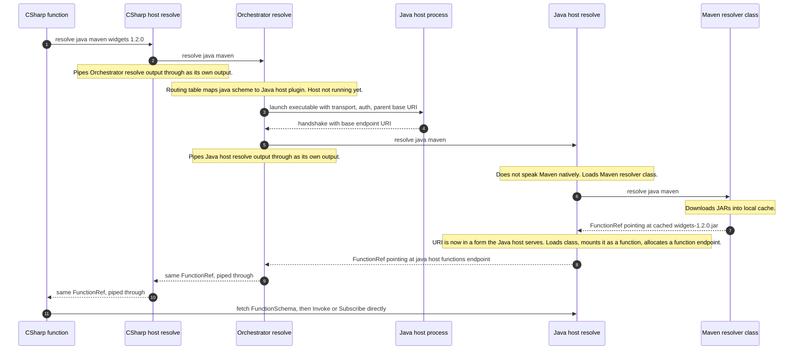

# gib

**Globally Infectious Build** — a continuously-running, signal-driven build system.

> Status: early prototype. Names, shapes, and APIs are all in flux.

---

## Manifesto

### The problem with build systems

Every build system in widespread use today — Make, MSBuild, Gradle, Bazel, npm scripts, GitHub Actions, Azure Pipelines — is built on the same 60-year-old idea: a **target graph** that you *invoke*, that *runs to completion*, and that *exits*. Inputs are scanned, staleness is computed, work is done, artifacts are written, the process dies. Tomorrow you do it again.

This shape leaks into everything around it:

- **IDEs invent "design-time builds"** to coax a dead build system into telling them about your code while you're typing.
- **CI/CD systems invent their own workflow languages** (YAML on YAML on YAML) to schedule and chain *more* one-shot builds across machines.
- **Watchers, daemons, and incremental caches** are bolted on after the fact to fake liveness.
- **State that should flow between steps** is smuggled through temp files, hash files, and global properties because the model has no first-class notion of "data moving from one stage to the next."
- **Cross-ecosystem builds** (e.g. Java artifacts feeding a .NET build) are nearly impossible without a third coordinator system on top.

The result is huge, magical, brittle. Authoring an MSBuild SDK or a Gradle plugin is a rite of passage, not an afternoon's work.

### The thesis

A build is not a one-shot script. **A build is a long-lived dataflow graph.**

If we treat it that way — explicitly, from the bottom up — most of the accumulated complexity dissolves:

- There is no "build vs. watch vs. design-time vs. CI." There is just *the pipeline*, which is always running. Editors, terminals, and CI agents are all just consumers attached to it.
- There is no global property bag. State is the *signals* flowing on the wires between functions.
- There is no temp-file smuggling. If stage B needs something from stage A, A emits it on a channel and B subscribes.
- There is no special distributed-build technology. A wire that crosses a process or a machine is still just a wire.
- There is no special IDE protocol. An IDE is just another function in the graph that taps the channels it cares about.

### Goals

1. **Easy at the small end.** A trivial build should be a short, readable text file. Closer to a `Makefile` than to a `csproj`.
2. **Limitless at the large end.** Expressive enough that something the size of the .NET SDK could be reimplemented natively on top of it.
3. **Always live.** A pipeline is started, not "run." It reacts continuously to changes in its inputs and continuously updates its outputs.
4. **No hidden state.** Everything one component tells another travels on a typed channel as an explicit signal. No global properties, no item groups, no implicit caches.
5. **Composable across ecosystems.** A C build, a Java build, and a .NET build should be able to coexist in the same pipeline and feed each other.
6. **Distributable by construction.** Because components communicate only through serializable signals on channels, any wire is a candidate for crossing a process or network boundary without changing the authoring model.
7. **Pluggable and discoverable.** Components ship with machine-readable schemas. They can be discovered, validated, and ultimately fetched from remote sources the way GitHub Actions resolves `uses:` references.
8. **Language-agnostic in principle.** The prototype is C#, but the contracts (signals, schemas, channels) are deliberately defined so that a Rust or Java implementation could host or interoperate with the same graph.

---

## `gip` is a specification, not just a library

It is worth drawing a sharp line between **`gip` the specification** and **`gip` the implementation in this repository**, because they are not the same thing and conflating them obscures how the rest of the system fits together.

`gip` the specification describes, in transport-agnostic terms, how functions, channels, and signals are addressed and exchanged across processes and machines. The C# code in this repository is one implementation of that specification — currently the only one — and most of what you can read in the source today is the in-process projection of concepts the specification defines abstractly. A second implementation in another language, or running in another process, would be peer to this one rather than a client of it.

The specification is layered as follows.

### Function Hosts

A **Function Host** is a service that exposes endpoints over one of the specification's transports. Every addressable thing in the system — every function type, every running function instance, every channel — ultimately lives at a URI on some Function Host. Resolving a function by URI eventually terminates at a host that can answer for that URI; subscribing to a channel by URI eventually terminates at the host that owns the channel. The implementation in this repository is, from the specification's point of view, the trivial Function Host: one host, one process, URIs that happen to resolve to local objects.

There is no notion of "the" Function Host. A pipeline can span any number of them, and they relate to each other strictly through URIs and the operations below.

#### Well-known host services are themselves functions

A Function Host is not just a passive container of user-authored functions. It also has a small surface of its own that callers — orchestrators, other hosts, tools — need in order to use it. `gip` does not invent a separate RPC vocabulary for this. Instead, every Function Host exposes a fixed set of **well-known services**, and each of those services is *itself a function* on the host.

Concretely, every Function Host serves a reserved namespace — `.well-known/...` underneath its base endpoint URI — under which a small, specification-defined set of functions always exists. For now there is exactly **one** well-known function, named `resolve`, described below; over time more well-known functions may be added (enumeration, manifest, health, graceful shutdown, and so on), but the `resolve` slot is the only one the spec currently requires every host to fill. Because the path is fixed, anyone who has a host's base endpoint URI can derive the URI of any of its well-known functions — in particular, `resolve` is always reachable at `<base>/.well-known/resolve` (transport binding permitting). Hosts therefore advertise themselves by their base URI, not by separately publishing each well-known function's URI.

Because these are ordinary functions, they are reached the same way every other function is reached: their URIs are endpoint URIs on the host, their schemas are fetched via the same metadata operation as any other function's schema, and they are invoked and subscribed to via the same `Invoke` and `Subscribe` operations on the same transport. There is no "control channel" separate from the dataflow channels — the host's self-description is just more graph.

The benefit is uniformity. An orchestrator that has just launched a plugin host (per *Function Hosts as launchable executables*) doesn't need a special discovery RPC to talk to it; it invokes the host's well-known `resolve` function and subscribes to its output like any other channel. New host capabilities are added by defining new well-known function names alongside `resolve`, not by extending a parallel protocol.

##### `resolve` — the host's well-known resolver

The single well-known function every Function Host is required to provide is named **`resolve`**. It is the host's contribution to the resolver chain described under *Function discovery is itself a function*, and it has a deliberately uniform shape:

- **Input:** a `ValueSignal<FunctionRef>` — the single reference the caller wants resolved. The `FunctionRef`'s URI is typically a logical one (for example a `gib:...` URI) that the caller has not yet been able to dial.
- **Output:** a `ValueSignal<FunctionRef>` — the resolved reference, whose URI is now a directly dialable endpoint URI.

Because both sides are channels, resolution is **dynamic and reactive** rather than a one-shot RPC: the caller updates the input value when it wants a different URI resolved, and `resolve` emits a new `FunctionRef` whenever its answer changes (a package version is upgraded, an override is installed, a remote source comes online). Resolving a batch of URIs is just invoking `resolve` once per URI; the function itself only ever deals with one reference at a time.

A host's `resolve` has two legitimate ways to answer for a given input:

- **Resolve directly.** If the URI names something the host already serves — most obviously its own `resolve` (or any future well-known function), but also any function type the host is willing to instantiate — `resolve` emits a `FunctionRef` whose URI is a directly dialable endpoint URI on this same host. That `FunctionRef` is the final answer for that input.
- **Chain to another `resolve`.** If the URI is one the host doesn't itself serve, `resolve` invokes the next `resolve` in the chain (typically the orchestrator's, see below) with the same `FunctionRef` as input, and **pipes that downstream `resolve`'s output channel straight through as its own output**. It does *not* emit an intermediate `FunctionRef` pointing at the next resolver. From the caller's perspective there is only ever one `FunctionRef` flowing on the output channel: the final, dialable one produced by whichever `resolve` deepest in the chain ultimately answers. Updates from the downstream `resolve` (a package version upgrade, an override installed) flow through the chain to the caller the same way.
- **Pass through unchanged.** If `resolve` doesn't recognize the URI *and* has no further resolver to chain into — it is at the end of the chain — it simply emits the input `FunctionRef` back unchanged. The spec's contract is that a `FunctionRef` which has traversed the entire chain without being rewritten is **assumed to already be a physical endpoint**, and the caller dials it directly. This is what makes "talk to a function that lives on a host I don't own" a normal case rather than a special one (see *Unmanaged remote endpoints* below).

The "chain to another `resolve`" half of that contract is what ties the chain together, and it is itself uniform: the **orchestrator is a Function Host too**, and it therefore exposes its own `resolve` exactly like any other host — at `.well-known/resolve` under its base endpoint URI. That `resolve` is the one a child host chains into when it cannot answer on its own. Concretely, when the orchestrator launches a child Function Host (per *Function Hosts as launchable executables*), one of the launch parameters it passes in is the **orchestrator's own base endpoint URI**. The child host stores that URI and, whenever its own `resolve` is asked about a `FunctionRef` it does not itself serve, derives the parent's `resolve` URI from that base (`<base>/.well-known/resolve`), invokes it, and pipes the result back through. There is no special "parent" RPC and no separate fallback protocol; the parent is just another `resolve` reached over the ordinary transport at the well-known path, and chaining to it is the same operation as chaining to anything else.

The chain itself is therefore not a special construct: it is just `resolve` functions on different hosts invoking each other and forwarding their outputs until one of them produces a dialable endpoint URI — or until the chain bottoms out and the input URI is treated as already physical. Only that final `FunctionRef` ever appears on the original caller's output channel — the intermediate hops are invisible to it. The orchestrator's job is to wire those `resolve` functions together — most importantly by handing its own base URI to every child host it launches so the child can reach `.well-known/resolve` on it; the spec's job is to guarantee that every Function Host has one to wire in.

##### Unmanaged remote endpoints

The "pass through unchanged" rule has a useful consequence: any URI whose scheme is one the spec already knows how to dial — most obviously `http://`/`https://`, but also `grpc://`, `http+unix://`, `http+npipe://`, `inproc:`, and any other transport scheme — can be used as a `FunctionRef` directly, even though no host in the chain has any idea what's behind it.

When such a URI is fed to a `resolve`, nothing matches it: no in-process function, no installed plugin, no remote provider, no parent host further up the chain. The orchestrator's `resolve` is at the end of the chain, so it emits the URI back unchanged. The caller dials it like any other endpoint URI, asks for its `FunctionSchema` via the metadata operation, and — if the thing on the other end actually speaks the spec's operations on the requested transport — invokes and subscribes to it like any other function.

What falls out of this is first-class support for **functions that live on hosts the orchestrator doesn't manage**: third-party web services, internal microservices, machine-local tools that happen to expose the spec on a Unix socket, anything reachable on a transport. These hosts are not plugins, they are not launched, they have no manifest in any plugin directory, and their lifetimes are not controlled by the orchestrator. They are simply remote endpoints whose URIs were already physical when the caller wrote them down. The spec doesn't have to grow a separate "foreign function" concept; the resolver chain's pass-through behavior gives it for free.

If the URI's scheme is not one the spec's transport bindings cover (or the endpoint at the other end doesn't speak the operations), the `Invoke`/`Subscribe`/metadata call simply fails the same way any other unreachable endpoint fails. There is no special "unknown scheme" error path at the resolver layer.

### Orchestrator Hosts

A **Function Host** answers for the URIs of functions, instances, and channels that live on it, but it does not, by itself, decide *what* to run. Something has to actually own a pipeline: pick the root function, hold the references that keep it alive, decide where its sub-functions get instantiated, and accept clients that want to observe or manage it. In `gip` that role belongs to an **Orchestrator Host**.

An Orchestrator Host is a long-lived executable that hosts one or more pipelines. It is the concrete shape of "the daemon" described later in this README — the daemon is, mechanically, an Orchestrator Host with a CLI/IDE-facing control surface bolted on. Different deployments ship the orchestrator in different forms (a developer daemon, a CI agent, a build farm controller), but at the spec level they are all the same thing: a process that owns running pipelines.

Orchestrator Hosts are not a new kind of node in the URI graph; they are *consumers* of Function Hosts. An orchestrator may:

- **Embed a Function Host in-process.** The trivial deployment — and the one this repository implements — is a single executable whose orchestrator and Function Host are the same process. URIs for functions and channels owned by that host resolve in-proc; the same orchestrator can still reach out to other hosts over HTTP/gRPC for anything it does not own.
- **Talk only to remote Function Hosts.** A thin orchestrator with no embedded host is also valid. It holds the references that keep the pipeline alive and dials out to one or more Function Hosts to invoke functions and subscribe to channels. The pipeline is "owned" by the orchestrator's references, even though no function actually runs in its process.
- **Mix the two.** Most realistic deployments will: cheap glue functions run in the orchestrator's embedded host, while expensive or specialized functions (compilers, test runners, sandboxed tools) run on dedicated Function Hosts the orchestrator dials out to.

The reference-counting rules from *Channel lifetime is reference-counted* still apply unchanged. A pipeline lives as long as the orchestrator keeps holding references to its root function's outputs (and as long as connected clients keep their subscriptions open); when the orchestrator drops those references and the last client disconnects, the pipeline winds down naturally on whatever Function Hosts it was using.

#### Function Hosts are installed as plugins

An orchestrator does not have a fixed, hard-coded set of Function Hosts it can use. Instead, it has a **plugin directory** — a well-known location on disk where additional Function Hosts are dropped to make them available to the orchestrator. On startup (and on demand thereafter) the orchestrator scans this directory, discovers each installed host, and registers it as something it can route URIs to or launch on behalf of a pipeline.

The shape is intentionally undramatic:

- **Each plugin is a self-contained Function Host.** From the orchestrator's point of view it is just another host that speaks the spec's operations over one of the standard transports. How it is implemented internally — a managed assembly loaded in-process, a native executable launched as a child process, a container started on demand, a sidecar already running on a known socket — is the plugin's business, not the orchestrator's.
- **Installation is a file-system operation.** Adding a Function Host means placing it in the plugin directory; removing one means deleting it. There is no central registry to update, no service to restart beyond the orchestrator itself, and no API the host has to call into to "register." The directory *is* the registry.
- **The embedded Function Host is just the always-present plugin.** A trivial orchestrator with only its embedded host behaves as if the plugin directory contained exactly one entry. Adding plugins extends what the orchestrator can serve; it does not change how anything else in the model works.
- **Resolved functions land on the right host.** When the resolver chain hands back a `FunctionRef` whose endpoint URI points at one of the installed plugin hosts, the orchestrator simply dials that host like any other. The plugin mechanism is what makes "install a build of CSharpCompile that runs out-of-process" or "ship a sandboxed test runner as its own host" a deployment concern rather than a code change in the orchestrator.

This is the moral equivalent of `~/.gradle/init.d` or a shell's `PATH` directory: a place to drop capabilities the long-lived process should pick up without anyone having to teach it about each one individually.

#### Function Hosts as launchable executables

The most common shape for a plugin Function Host is simply an **executable** sitting in the plugin directory. The orchestrator does not require the host to already be running, and it does not require the user to start it manually; it launches the host on demand and talks to it over one of the standard transports. The launch and discovery protocol is itself part of the specification, so any executable that follows it can serve as a Function Host regardless of the language it was written in.

The protocol has three small pieces:

- **Discovery.** Each plugin in the directory is laid out as a self-describing bundle: an executable plus a small **host manifest** sitting next to it. The manifest declares the host's identity (a stable name and version), the URI schemes/prefixes it claims to serve, the transports it can speak, and any launch-time options it accepts. The orchestrator scans the directory, reads each manifest, and builds a routing table: "URIs matching *this* shape go to *that* host." No code from the plugin runs during discovery — the manifest is enough to decide whether and when the host is needed.
- **Launch.** When the orchestrator first needs a host — because a `FunctionRef` resolved to one of its URIs and something is about to `Invoke` it — it spawns the executable as a child process. Note that *subscribing* to a channel is never what triggers a launch: a channel is only reachable as long as the function that produced it is still running (or other subscribers are already attached), so by the time anyone has a channel URI to subscribe to, the host that owns it is by definition already up. Launch is always provoked by a function call, not by a subscription.
- **Handshake.** Once running, the host **publishes its endpoint** back to the orchestrator. The simplest form is to write a single line to standard output (or to a known file path supplied at launch) containing the endpoint URI it is listening on — `http+unix:///run/gib/host-7c.sock`, `grpc://127.0.0.1:51244`, or similar. The orchestrator reads that line, treats the URI as the host's base endpoint, and from then on routes any URI in the host's claimed namespace to it using the ordinary spec operations. The handshake itself carries no schema information; `FunctionSchema`s are always retrieved dynamically from each function's own endpoint via the spec's metadata operation, the same way any other client would fetch them.

Once launched, a host is just another peer Function Host on the network. Its lifetime is managed by the orchestrator the same way every other resource is: as long as something in the pipeline holds references that route to URIs on this host, it stays alive; once nothing does, the orchestrator can shut it down (gracefully, via a spec-defined shutdown operation) and reclaim the process. A host that crashes is relaunched on the next URI that needs it; a host that is uninstalled (its directory deleted) is dropped from the routing table on the next scan.

Because launch and handshake are spec-level operations rather than implementation details, the same plugin executable works identically across orchestrator implementations and languages. A NuGet-packaged C# host, a Rust binary, and a Python script wrapped as an executable are all the same kind of thing from the orchestrator's point of view: a manifest, an executable, and a URI on stdout.

#### Remote plugin providers fill in what isn't installed locally

The plugin directory covers everything the user (or their tools, or their CI image) has chosen to install ahead of time. It does not have to cover *everything that exists*. When the orchestrator's `resolve` is asked about a URI whose scheme/prefix matches no installed plugin and no in-process function, the spec allows it — as a last step in its own resolver chain, before giving up — to consult one or more **remote plugin providers**: well-known online repositories that map URI schemes to downloadable Function Host plugins.

The shape mirrors the local plugin directory, just with the network in front of it:

- **The provider is a `resolve`-compatible service.** From the orchestrator's point of view a remote plugin provider is just another `resolve` reachable over the ordinary transport at a configured base URI. Its job is to take a `FunctionRef` whose URI uses some scheme or prefix and answer with a `FunctionRef` describing the plugin that knows how to serve it — most commonly by pointing at a downloadable plugin bundle (manifest + executable) under a `gib:plugin/...`-style URI the orchestrator already knows how to install.
- **Discovery is asymmetric.** Local plugins are discovered eagerly by scanning the directory; remote providers are consulted lazily, only when nothing local matched. There is no "list everything" call against a provider, and there does not need to be: the orchestrator only ever asks about URIs it has actually been handed.
- **Installation closes the loop.** When a provider answers with a plugin bundle, the orchestrator downloads it, drops it into the plugin directory (or a managed cache that participates in the same scan), reads its manifest, and from then on treats it like any other installed plugin — including launching it on demand as a Function Host. The next time the same URI scheme is resolved, the orchestrator answers from the local routing table without going back to the provider.
- **The set of providers is itself configurable.** A given orchestrator deployment ships with some default provider URI (the project's own public repository, say), but operators can add private providers, replace the default, or disable remote lookup entirely. CI environments and offline builds typically pin the provider list (or empty it) so resolution is fully deterministic against what is already on disk.
- **Trust is explicit.** Because consulting a remote provider can result in code being downloaded and later launched as a child process, providers are gated by the same authentication/authorization story as any other host the orchestrator dials, and downloaded plugin bundles are subject to whatever signature and integrity checks the orchestrator is configured to require. "Auto-install from the internet" is a *policy* enabled per deployment, not an unavoidable behavior of the spec.

The net effect is that "I don't have a Java host installed" stops being a hard error and becomes "I don't have one *yet*." A `java:` URI flows through the local resolver chain, misses every installed plugin, reaches the remote provider step, and — if policy allows — comes back as an installed and launched Java host serving exactly the URIs it claimed it could. Everything downstream of that point (the per-host `resolve`, the chaining behavior, the worked scenario below) is unchanged; the remote provider just made the plugin appear.

#### A worked launch scenario: calling into a Java function from C#

The pieces above — the orchestrator's plugin directory, manifest-based discovery, on-demand launch, the per-host `resolve`, and the orchestrator's base URI handed to children as their fallback — are designed to compose without any extra cross-host machinery. The easiest way to see this is to walk a concrete cross-ecosystem call end to end.

The setup:

- The orchestrator is running, with an embedded C# Function Host already serving in-process functions.
- A Java Function Host is **installed** as a plugin (its executable and host manifest live in the orchestrator's plugin directory) but is **not yet running**. Its manifest claims the `java:` URI scheme.
- A function currently executing inside the C# host wants to invoke another function whose logical URI starts with `java:` — say, `java:maven/com.acme/widgets@1.2.0#com.acme.widgets.Build`.

Nothing in that URI tells the C# function how to dial anyone. It just hands the URI to its local `resolve` and waits for an endpoint URI to come back. Everything from there is `resolve` functions invoking other `resolve` functions over the ordinary transport and forwarding their output channels through, with the orchestrator launching whatever processes the chain needs. Only the *final* `FunctionRef` — the one produced deepest in the chain — ever appears on the caller's output channel; every intermediate hop is invisible to it.

1. **Local `resolve` (C# host) cannot answer.** The C# host's `resolve` is asked about `java:...`. It does not serve that scheme and has no plugin of its own that does, so it does the standard "chain" thing: it derives the orchestrator's `resolve` URI from the orchestrator's base URI (handed to it at launch) as `<base>/.well-known/resolve`, invokes that `resolve` with the same `FunctionRef` as input, and pipes that invocation's output channel straight through as its own output. The caller sees nothing yet; the C# host's `resolve` output is just a passthrough now.
2. **Orchestrator `resolve` consults the routing table.** The orchestrator's `resolve` looks at the routing table it built when it scanned the plugin directory, sees that the `java:` scheme is claimed by the Java host plugin, and decides this URI belongs to that host. It does not answer; like the C# host, it is going to chain.
3. **Orchestrator launches the Java host on demand.** The Java host is not running yet, so the orchestrator spawns its executable per the *Function Hosts as launchable executables* protocol: it passes the transport(s) to bind, an auth token, a working directory, and — critically — the **orchestrator's own base endpoint URI**, so the Java host has a parent host to fall back to (its `resolve` is at `<base>/.well-known/resolve`). The Java host starts, binds its transport, and writes its own base endpoint URI back to the orchestrator as its handshake.
4. **Orchestrator chains into the Java host.** Now that the Java host is reachable, the orchestrator's `resolve` invokes the Java host's `resolve` with the same `java:...` URI as input, and pipes that invocation's output channel through as its own output — which is in turn already piped through as the C# host's `resolve` output, which is in turn the caller's input channel. There is one logical channel from the caller all the way down to the Java host's `resolve`; nothing intermediate is ever materialized as a `FunctionRef` on the wire.
5. **Java host's `resolve` interprets the rest of the URI.** The Java host now sees `java:maven/com.acme/widgets@1.2.0#com.acme.widgets.Build` for the first time.
    - a direct path to a `.jar` plus a class name,
    - a direct path to a `.class` file,
    - or — as in this case — a sub-protocol like `java:maven/...` which itself denotes *a Java class that acts as a resolver plugin*. The Java host doesn't know how to talk to Maven directly; it knows how to load a Java class that does.
6. **Java host extends the URI space at runtime.** To handle `java:maven/...`, the Java host downloads (or finds in its local cache) a Java class that implements the resolver-plugin contract for the `maven` sub-scheme, loads it into the JVM, and treats it as **another `resolve` in the chain**. The original `FunctionRef` is handed to that loaded class. This is the recursive step: Java-level resolver plugins extend `resolve` from inside the Java host the same way orchestrator-level plugins extend `resolve` from inside the orchestrator. The mechanism — emit a `FunctionRef` pointing at the next resolver — is identical at every layer.
7. **The Maven resolver plugin pulls the artifact down.** The loaded Maven resolver interprets `com.acme/widgets@1.2.0`, fetches the JAR (and any transitive JARs) from a Maven repository into local cache, and then re-emits a `FunctionRef` whose URI is the now-locally-resolvable form: e.g. `java:jar/<cache-path>/widgets-1.2.0.jar#com.acme.widgets.Build`. If resolving *that* form requires loading yet another resolver class — say, a JAR that itself implements a different sub-protocol — the same trick repeats: load the class, treat it as a `resolve`, hand it the URI. The chain is as long as it needs to be and is built out lazily as URIs are encountered.
8. **The Java host instantiates the function and publishes an endpoint.** Eventually the chain bottoms out at a URI the Java host itself can serve: a concrete Java class that is a `gip` function. The host loads the class, instantiates it as a function instance, allocates a fresh endpoint URI for that instance under its own base endpoint (something like `https://java-host.local:51244/instances/7c.../`), and emits a `FunctionRef` pointing at it as the final answer flowing back up the `resolve` chain.
9. **Back in C#, the original caller dials the endpoint.** Because every intermediate `resolve` was just piping its downstream output through, that final `FunctionRef` lands directly on the caller's `ValueSignal<FunctionRef>` as the resolved value — the C# host's `resolve` did not transform it, and neither did the orchestrator's. The URI on it is now a directly dialable endpoint URI **on the Java Function Host**. The C# function fetches its `FunctionSchema` from that endpoint via the spec's metadata operation (the `FunctionRef` itself carries no schema) and from then on talks to the Java host directly, with no orchestrator or C# host in the data path.

The diagram below traces the same flow. Note that there is no special "plugin protocol", no Java-aware code in the C# host, and no Maven-aware code in the orchestrator. Every arrow that crosses a host boundary is either a `resolve` call or a launch:



A few properties of this scenario are worth calling out, because they fall out of the host model rather than being designed in:

- **Lazy launch.** The Java host process only exists because someone tried to resolve a `java:` URI. No `java:` traffic, no Java process. Uninstalling the plugin (deleting it from the directory) makes future `java:` resolutions fail at the orchestrator step, with no other component needing to know.
- **Recursive resolution at every layer.** "Plugin host extends the orchestrator's URI space" and "Java class extends the Java host's URI space" are the same mechanism: a `resolve` answers by pointing at another `resolve`. The chain can be arbitrarily deep, and each link can perform side effects (downloads, code loading, cache population) as part of answering.
- **Only the final hop is a real function endpoint.** Intermediate `resolve` calls don't emit `FunctionRef`s of their own; they invoke the next `resolve` and pipe its output channel through. The only `FunctionRef` that ever reaches the caller is the final one, pointing at an actual **function** — something the caller can `Invoke` repeatedly. The caller never has to know how many hops it took, and never has to make a follow-up resolve call.
- **The data path bypasses the chain.** Once that final `FunctionRef` arrives, the caller dials the endpoint directly. In this scenario the C# function ends up talking straight to the Java host — the orchestrator and the C# host's own `resolve` are not in the path of any subsequent `Invoke`, `Subscribe`, or metadata call. The resolver chain exists to find an endpoint, not to proxy traffic through it.
- **`FunctionRef` stays trivial throughout.** Nothing in the chain attaches schema, type info, or transport hints to the reference. The URI is replaced; that is the entire payload. Schema is always something the caller fetches from the final endpoint, after resolution is done.

### Transports

A **transport** is a concrete protocol binding that carries the specification's operations between hosts and clients. The specification defines the operations once; each transport defines how they travel on the wire. Two transports are anticipated initially:

- **HTTP** — request/response operations over plain HTTP; long-lived subscriptions modeled as long-running `GET`s that stream items as they arrive.
- **gRPC** — the same operations over gRPC, with subscriptions naturally expressed as server-streaming RPCs.

Other transports are admissible — WebSockets, raw streams, in-process direct calls — and the URI of a host or channel describes both *which* transport to use and *how* to connect to it. **Every operation is available over every transport.** There is no "this op only works on gRPC" carve-out; the operation set is small enough that this is achievable.

### URIs

`gip` distinguishes two kinds of URIs, and the difference is important enough to call out before the operations that consume them.

#### Endpoint URIs — *where* to talk

An **endpoint URI** identifies a concrete addressable thing on a Function Host: a **function** the host serves (which can be `Invoke`d any number of times) or a **channel** the host owns. It is what the operations actually take as input. An endpoint URI is *physical*: it names both a transport and a destination on that transport, and it can be dialed directly without any further resolution step.

Note that there is no separate "per-call" addressable entity between a function and its channels. A function is the thing with a URI and a `FunctionSchema`; each `Invoke` against that URI is a fresh call that allocates its own input/output channels (which themselves have URIs). Two `Invoke`s with structurally identical inputs do **not** alias each other or share their output channels — the runtime never deduplicates calls. Reuse is something a caller arranges explicitly, by holding onto an existing channel URI and handing it around, not something `Invoke` does on the caller's behalf.

The default and most common form is an ordinary HTTP URL. The path identifies the function or channel; the authority and scheme identify the host and transport:

```
https://daemon.example.com:7000/functions/builtin/copy-tree
https://daemon.example.com:7000/functions/8b3f…
https://daemon.example.com:7000/channels/2c91…
```

Other transports get other schemes, but the shape is the same — a transport-bearing URI that already knows how to be dialed:

```
http+unix:///run/gib/daemon.sock/channels/2c91…       # HTTP over a Unix domain socket
http+npipe://./pipe/gib-daemon/functions/builtin/glob # HTTP over a Windows named pipe
grpc://daemon.example.com:7001/channels/2c91…         # same operations, gRPC framing
inproc:host-12/channels/2c91…                         # in-process, this repo's trivial host
```

These are deliberately mundane. An endpoint URI is just *"this thing, on this host, reachable via this transport."* The HTTP binding section above describes what the operations look like when the transport is HTTP; other transports describe their own framing for the same operations. The URI is what tells a client which one to use.

#### Logical URIs — *what* you want, regardless of where it lives

A **logical URI** identifies a function (or, less commonly, a channel) by name rather than by physical address. It says nothing about what host serves it or what transport gets you there; it only says which thing you want. The `#r` examples in the DSL section are all logical URIs:

```
gib:builtin/copy-tree
gib:nuget/Acme.Build.Widgets/CSharpCompile@1.4.2
gib:maven/com.acme.build/widget-tasks/CodeGen@2.0.0
gib:git/github.com/acme/widgets//functions/Pack@v3
```

A logical URI is not directly dialable. Before any operation can be performed against it, it has to be turned into an endpoint URI by the **resolver chain** described under *Function discovery is itself a function*. The resolver takes a logical URI in and produces a `FunctionRef` whose endpoint is an endpoint URI of the kinds shown above. From that point on the runtime works only with the endpoint URI; the logical URI's job is done.

Two consequences fall out of this split:

- **Logical URIs are stable; endpoint URIs are situational.** `gib:nuget/Acme.Build.Widgets/CSharpCompile@1.4.2` means the same thing on every machine and every day. The endpoint URI it resolves to depends on which host happens to be serving that function in this pipeline, on this run, and may legitimately differ across machines or be re-resolved over time.
- **Only logical URIs go through the resolver.** Any URI that already names a transport and a destination — `https://…`, `http+unix://…`, `grpc://…`, `inproc:…` — is by definition already resolved. Handing such a URI to the resolver is a no-op; handing it to an operation just dials it. Conversely, handing a `gib:…` URI directly to a transport is an error: there is nothing to dial until the resolver has been consulted.

The rest of this specification, unless it explicitly says otherwise, talks about endpoint URIs. Logical URIs only appear in two places: as inputs to the resolver, and as the values of `#r`-style import directives in DSLs. Everywhere else — in the body of an `Invoke`, on the wire of a `Subscribe`, in a `FunctionRef.Endpoint` — the URI in play is an endpoint URI.

### Operations

The operation surface is intentionally minimal:

- **`Invoke`** — call a function. The caller supplies the function URI together with the URIs of the channels that serve as input parameters. The host returns the URIs of the channels that serve as outputs. Invocation is *not* a request to compute a value; it is a request to instantiate the function and wire its inputs and outputs to the addresses given. The function then runs for as long as the graph keeps it alive.
- **`Subscribe`** — read signals from a channel by URI. This is the streaming operation: HTTP implements it as a long `GET`, gRPC as a server-streaming RPC, and so on. The transport may differ, but the contract — "give me every signal on this channel from some point onward" — does not.
- **Metadata operations** — fetching a function's `FunctionSchema`, describing a channel's signal type, and similar introspection that the resolver chain and DSL proxy machinery rely on.

That is essentially the entire surface. Everything else in `gip` and `gib` is built out of these primitives.

### HTTP binding

The HTTP transport pins the operations above to a small, conventional shape. It is the default transport, the one a stock `gip` host is expected to speak, and the reference against which other transports can be checked for behavioural parity.

- **`Invoke` is `POST` to the function endpoint.** The function URI *is* the request URI. The request body is a serialized message whose payload is the channel content the caller is supplying — the input channel URIs to bind, plus any inline parameter signals the caller would rather pass directly than allocate a separate channel for. The response body is, symmetrically, a serialized message containing the channel URIs that the host has wired up as the function's outputs.
- **`Subscribe` is `GET` to the channel endpoint.** The channel URI is the request URI. The response is a long-running stream of framed signal messages in the channel's declared signal type, delivered in order from whatever starting point the request specifies (current state, a known position, or the beginning of retained history) and continuing until the client disconnects or the channel is released.
- **Metadata is `GET` to the function or channel endpoint** with a content negotiation marker that asks for the schema rather than the live stream — for example a distinct `Accept` type, or a sibling `…/schema` URI. The response is a serialized `FunctionSchema` (for a function) or signal-type descriptor (for a channel).

#### Payload format is negotiated, not encoded in the URI

Nothing in any URI says *which* serialization is on the wire. URIs name the host, the transport, and the resource; they deliberately do not name the encoding. Picking an encoding is a job for whatever native facility the transport already provides for that, and the HTTP binding uses HTTP's: **standard `Accept` and `Content-Type` headers**.

In practice that means a Protobuf-capable client and a Protobuf-capable host will agree on a Protobuf media type (`application/x-protobuf` or similar — exact spelling not yet pinned) on every `Invoke`, `Subscribe`, and metadata request, and the bytes on the wire are Protobuf. A host that supports more than one encoding may advertise alternatives (a debug-friendly JSON projection, for example) and clients pick whichever they prefer via `Accept`. A host that only supports Protobuf simply 415s anything else. The signal type system itself is unchanged either way: the same `FunctionSchema` and signal hierarchy describe the data regardless of which media type the client and host negotiated to carry it.

Other transports do the equivalent in their own native way — gRPC has its own content-type and codec negotiation, in-process calls don't need any negotiation at all — but the principle is the same: the URI names the resource, and the transport's existing mechanisms decide what bytes flow through it.

Two consequences of this shape are worth calling out, because they are what make the binding work cleanly with the rest of the model:

- **The HTTP request itself holds the call open.** The `POST` for `Invoke` does not return as soon as the function has been wired up; it stays open for the duration of the call. The function runs while the request is open and terminates when it either completes naturally or the client cancels the request. There is no separate liveness or reference-counting protocol layered on top — the in-flight HTTP/2 stream *is* the reference. The same applies to `Subscribe`: the channel stays alive on the owning host as long as at least one `Subscribe` `GET` is held open against it (in addition to whatever local references the producing function holds). HTTP/2 makes this practical: many concurrent long-lived streams over a single connection are exactly what the protocol was built for.
- **Channel content has one logical shape, regardless of encoding.** Whether a channel is being delivered as the body of a `Subscribe` `GET` or referenced by URI in the body of an `Invoke` `POST`, the *logical* representation of a signal is the same — the spec's signal hierarchy *is* the payload format. The concrete bytes (Protobuf today, possibly other encodings in future) are whatever the transport-level content negotiation picked; the signal type system is what both ends agree on above that.

### Errors and exceptions

Functions are expected to behave like ordinary functions in any reasonable language: they can succeed, and they can fail. Failure is modeled as a thrown exception, and the spec is intentionally simple about what that means.

- **Exceptions are terminal for the function.** A function that throws (or otherwise fails to recover from an internal error) does not partially produce more output, retry on its own, or transition into a degraded steady state. It stops. Any of its output channels that are still open are released as part of that termination — the spec's reference-counting rules then take care of cleaning them up the same way they would for a function that simply ran out of inputs and exited.
- **The exception is delivered to the caller.** The exception propagates out through the same `Invoke` relationship that brought the function into existence: the function that called `Invoke` ultimately sees the failure and has to either handle it or rethrow it to *its* caller. In the in-process implementation this is just an exception bubbling up through async code. In a cross-host deployment it crosses the transport: the host running the failed function reports the exception (with whatever type/message/stack diagnostic the transport can carry) back along the path of the call, and the calling host re-raises an equivalent exception in its own runtime.
- **There is no separate \"error channel\".** The spec does not introduce a parallel error pipeline alongside the data channels. A function's outputs carry signals; failure is communicated through `Invoke`'s call-site, not by emitting a special signal type. This keeps the channel hierarchy purely about data and keeps error handling structurally identical to any other call.

#### How errors look on HTTP

The HTTP binding maps exceptions onto things HTTP already does. Two cases come up, depending on whether the failure happens before or after the channels have been wired up.

- **Failure during `Invoke` itself.** If the function fails to start, or fails synchronously during the part of `Invoke` that allocates and wires its output channels, the `POST` fails: the host responds with an error status and a serialized representation of the exception in the response body. There are no output channels for the caller to subscribe to — there is just the failed call. The caller sees this exactly as if a remote method call had thrown.
- **Failure after `Invoke` has returned.** Once `Invoke` has returned channel URIs, the function is in its running phase, and any later failure is observed through those channels rather than through the original (already-completed) `POST`. Concretely, every open `Subscribe` connection against an output channel of the failed function **terminates with an error**: the streaming response is closed before reaching the natural end-of-stream, and the close carries the exception in the same serialized form an `Invoke` error response would. From the subscriber's point of view the channel went from \"streaming signals\" to \"connection terminated with this exception,\" and the subscriber is responsible for surfacing that to whatever code was reading the stream.

In both cases the wire-level details (status codes, framing of the serialized exception, content negotiation for the exception payload) follow the same rules as the rest of the HTTP binding: the exception is just another payload, negotiated via `Accept`/`Content-Type` like everything else, and the HTTP error mechanisms (4xx/5xx for `Invoke`; abnormal stream termination with a trailer or framed error for `Subscribe`) are the carriers.

Other transports do the equivalent in their own native way — gRPC has status codes and trailers, in-process calls just rethrow the original exception object — but the principle is the same: the function's exception reaches the caller through whichever of its in-flight relationships is still live (the `Invoke` response if the call has not yet returned; the open `Subscribe`s on its outputs if it has).

### Channels are first-class addressable resources

A consequence worth stating explicitly: **channels are independent, URI-addressable resources**, not implicit return values from a function call. The host that creates a channel is its owner; functions running on that host emit signals into it; any other host that wants to read it does so by `Subscribe`-ing to its URI through the appropriate transport.

This is what makes `Invoke` work the way it does. Because the caller supplies *channel URIs* as inputs and receives *channel URIs* as outputs, channels can be allocated, passed around, and connected without ever being routed through the function whose outputs they happen to be. A channel produced on host A can be handed straight to a function running on host B; B simply subscribes to A's URI for the inputs it cares about, and the data crosses the wire only when there are signals to deliver. The "wire" between two functions in the graph is, at the spec level, just a URI both ends agree on.

It also explains the channel ownership rule introduced earlier ("the sender owns the log") in concrete terms: the sender's *host* is the authoritative source for the channel's history, retention, and compaction. Every other host is a subscriber that reaches back to the owner over a transport.

### Channel lifetime falls out of held-open requests

Channels are not retained forever, and the specification does not require any explicit `Close` or `Delete` operation to clean them up. There is also no separate distributed reference-counting protocol — the transport's own notion of "the request is still open" is what counts. On HTTP, that means:

- A running function holds a local reference to each of its own output channels for as long as it is running, which on the wire is *for as long as its `Invoke` request is still open on the calling side*. When the caller cancels the `POST`, or the function naturally completes and the response stream closes, that local reference goes away.
- Each subscriber holding an open `Subscribe` `GET` against a channel counts as a live reference on the owning host. The channel cannot be reclaimed while any such stream is open.
- Once the producing function's `Invoke` has ended *and* every `Subscribe` stream against its outputs has closed, the owner has no held-open request keeping the channel reachable and is free to release it.

What this consumes on the host is small and concrete: an entry in some table representing an ongoing operation — one row per held-open `Invoke`, one row per held-open `Subscribe`. Cancelling the request removes the row; the channel and the function fall out of scope with it. Other transports do the equivalent with whatever "this call is still in progress" primitive they natively provide; the principle is the same.

The practical effect is that lifetime management falls out of the same requests and streams that already exist for dataflow. There is no separate ownership protocol, no leases, no manual teardown — a channel exists for as long as some transport-level operation is still holding it open, and is reclaimed otherwise.

### Where the implementation fits

The C# code in this repository implements the specification's concepts in-process: a single Function Host, an in-proc transport whose `Invoke` is a method call and whose `Subscribe` is an in-memory observation, and URIs that happen to resolve to local objects. Everything described in the rest of this README — `FunctionContextBase`, `ICallContext`, `ValueSignal<T>`, `SetSignal<T>`, `SequenceSignal<T>`, the resolver chain, the DSL — is the in-process projection of the specification. Cross-process and cross-machine deployments are not a separate runtime; they are simply additional hosts and additional transports speaking the same operation set.

---

## How this is layered

The codebase is split into two cooperating layers, but the **function** is the central abstraction at every level.

### `gip` — the function runtime

`gip` is the lower layer and knows nothing about builds. It defines **functions**: long-running reactive computations that consume input channels and produce output channels. A function is *not* a one-shot call; it is a process that lives for as long as the graph it belongs to and reacts to signals as they arrive on its inputs.

Everything in a `gip` graph is a function:

- A file watcher is a function whose outputs describe a changing set of files.
- A compiler is a function that consumes source channels and produces artifact channels.
- A converter that bridges two signal shapes is a function.
- A composite that internally instantiates and wires together other functions is itself a function.
- A DSL parser that materializes a whole subgraph from a text file is, again, just a function.

Functions compose. A function can spawn child functions, connect their channels, replace them, or tear them down — all dynamically, all at runtime. The runtime treats a graph of one function and a graph of ten thousand functions identically.

The two big concepts in `gip` itself are **channels** and **signals**, described in detail below.

### `gib` — the build-system layer

`gib` is the build-flavored layer on top of `gip`. It does not introduce a new runtime primitive; it is a collection of **functions** that happen to do build-shaped things — watch source trees, invoke compilers, pack artifacts, drive test runners. Everything `gib` ships is, mechanically, a `gip` function with a build-relevant schema.

`gib` also includes an optional OO convenience layer (currently surfaced as the `Element` base class and the `[Element]` attribute) for authors who would rather write a class with named properties than wire a bare function by hand. This is purely an ergonomic façade: an element is a function, and the function is what the runtime actually sees and runs. The rest of this document talks about functions; mentions of "elements" refer only to that thin OO wrapping.

---

## Channels

A **channel** is a typed, ordered stream of **signals** flowing from one function to another. Channels are the *only* way information moves through a `gib` pipeline. There are no shared variables, no global property bags, no scratch files implicitly understood by both sides — just channels between functions.

### Channels are opaque to the runtime

A channel has a static type (the signal type it carries), but the **meaning** of the data on a channel is known only to its endpoints. The runtime is not in the business of interpreting payloads. It transports signals; it does not understand them.

This is intentional. The set of things one function wants to tell another is unbounded — file paths, file *contents*, ECMA-335 metadata tables, diagnostics, byte ranges of a PE section, "this row in this table just changed." Trying to enumerate those in a closed type system would either constrain the system or balloon it. Instead, `gip` provides a small set of *shapes* that almost any kind of information can be expressed in, and lets the endpoints agree on what the payload means.

### Channels are event-sourced

The signals on a channel describe **changes over time**, not snapshots. A subscriber that joins late and reads the full history of a channel can reconstruct the current state. A subscriber that stays attached forever sees the state evolve incrementally without ever having to poll.

This is event sourcing, applied to the wires between functions:

- The sending function does not publish "the current set of source files." It publishes "a file was added," "a file was removed," "the set was cleared."
- The receiving function does not pull "the latest value." It folds incoming signals into whatever local state it needs to maintain.
- A late subscriber can be brought up to date by replaying the relevant history; a live subscriber simply continues from where the log is.

Because signals describe *changes*, the channel itself is the durable record of what happened. Caches, change-detection files, and timestamp comparisons — the things traditional build systems invent to recover incrementality — are unnecessary: the incremental information *is* the channel.

### Senders own the log; history is compacted, not flushed blindly

The history on a channel is not infinitely retained by contract. The **sender decides** when earlier signals are no longer load-bearing and can be replaced by a more compact prefix that folds to the same current state. The rule is: a late subscriber that reads the retained prefix and then follows live signals must end up in the same logical state as a subscriber that has been attached the whole time. As long as that holds, the sender is free to compact.

This matters in practice:

- A scalar value channel only ever cares about its latest value. Each new value is emitted as a `Reset` followed by a `Set` (or an equivalent paired signal), which makes earlier values formally superseded — the retained prefix collapses to a single current value.
- A file watcher that has emitted thousands of `Add`/`Remove` signals can, when convenient, emit a `Clear` followed by a fresh batch of `Add` signals representing the current set — collapsing its history into an equivalent but smaller representation. This is something the sender knows holistically: it knows when prior deltas no longer matter.
- A long-lived sequence channel can be truncated when its early entries are no longer interesting, in the same way: a `Clear` followed by the entries the sender wants late joiners to still see.

Functions must therefore be written so that they react to *signals*, not to a fixed historical position. Late joiners get whatever the sender has chosen to retain plus everything from then on; they should always end up in the same logical state.

### Two basic patterns

While the meaning of a channel is up to its endpoints, almost every channel falls into one of two patterns:

#### 1. A single value that changes over time — `ValueSignal<T>`

The channel represents one logical value of type `T` that may be replaced over the lifetime of the pipeline. Each signal either sets the value or otherwise updates what "the current value" is. Subscribers typically only care about the most recent one.

Example: the destination directory of a copy operation is a `ValueSignal<AbsoluteFile>`. There is exactly one destination at any moment, but it can change, and downstream behavior must adapt when it does.

#### 2. A collection that changes over time — `SetSignal<T>` and `SequenceSignal<T>`

The channel represents a logical *collection* whose contents evolve. Rather than re-emit the whole collection on every change, the sender emits incremental deltas:

- **`SetSignal<T>`** — an unordered set, with deltas like `Add`, `AddMany`, `Remove`, `RemoveMany`, `Clear`, plus framing signals (`Freeze`/`Resume`) that let a sender bracket a batch of related changes so the receiver can apply them atomically.
- **`SequenceSignal<T>`** — an ordered, append-style stream, with deltas like `Append`, `AppendMany`, `Clear`, and the same framing markers. Useful for log-like channels and for any case where order matters.

The example function `Gib.Base.IO.CopyTree` shows both in action:

#### Other patterns are allowed

These two are conventions, not limits. A channel's signal type can be anything — a richer hierarchy describing structural changes to an ECMA-335 metadata table, a stream of byte-range updates to a PE file, a notification that a Roslyn workspace has produced new diagnostics. The runtime's only requirement is that the signals are typed and serializable; everything else is an agreement between the two functions on either end.

### Wire format

Signal types in `gip` are defined as small, closed hierarchies of Protobuf-tagged messages. This is deliberate: the wire format is fixed, and any channel can in principle be transported across a process or network boundary by inserting transport functions on either side. Cross-process and cross-machine communication is not a separate feature of `gib`; it is what naturally falls out of channels being serializable from day one.

---

## The daemon

"Always live" implies a process that is, in fact, always there. In `gib` that process is the **daemon**: a long-lived host that owns running pipelines and brokers all access to them. Mechanically, the daemon is an **Orchestrator Host** (see *Orchestrator Hosts* in the `gip` specification above) with a CLI/IDE-facing control protocol on top — typically with an embedded Function Host so trivial deployments are a single executable, but free to dial out to other Function Hosts for anything it does not run itself. Everything else — the CLI, the IDE, a CI agent — is a *client* that connects to the daemon over that control protocol.

The model is closely analogous to the Gradle daemon, with one important difference: `gib` is built around the daemon from day one rather than treating it as an optimization. The daemon isn't a cache for a CLI tool; the CLI is a thin client of the daemon.

> **Note on terminology.** "Channels" and "signals" in the rest of this README refer strictly to the in-graph dataflow primitives that functions use to talk to each other.

### Lifecycle

- The `gib` CLI does not run pipelines itself. When invoked, it locates a suitable daemon — by workspace, by pipeline identity, by version — and either attaches to an existing instance or spawns a new one.
- A spawned daemon stays resident after the CLI exits. Subsequent CLI invocations reattach to it instead of starting over.
- An IDE opening the same workspace connects to the **same** daemon. It is not running a parallel build; it is observing the live pipeline that the CLI also talks to.
- A CI agent does the same thing on its build machine: it spawns or attaches to a daemon, points it at the commit being built, and observes the relevant channels.

The daemon is the single source of truth for the state of a pipeline. There is exactly one running graph per logical pipeline instance, and every client sees the same signals coming off it.

### The CLI is a control-protocol client

Because the daemon owns the pipeline, the `gib` CLI's job is small and uniform: send commands to the daemon over the control protocol, and render whatever the daemon streams back. Examples of what that looks like in practice:

- `gib up` → connect to (or spawn) the daemon for this workspace and ask it to ensure the pipeline is running.
- `gib status` → ask the daemon for a status snapshot and print it.
- `gib watch <channel>` → ask the daemon to forward the live contents of an in-graph channel to the CLI, which prints each signal as it arrives.
- `gib stop` → ask the daemon to stop the pipeline; the daemon may or may not exit depending on other connected clients.

The control protocol is a normal request/response + streaming RPC; it does not run any pipeline code on the client side. An IDE or any other tool speaks the same protocol and has no special privileges relative to the CLI.

### Aggressive function caching

The daemon's biggest performance lever is that *nothing has to be rebuilt across invocations*. Where Gradle caches build state and reuses a JVM, `gib` goes further and caches the **live functions themselves**:

- Functions stay mounted and warm between client sessions. Their internal state (Roslyn workspaces, compiler caches, file watchers, parsed ASTs) is preserved.
- Channel histories are retained according to each sender's policy, so a client that disconnects and reconnects resumes from the current logical state without replaying the world.
- When inputs are quiescent, functions idle. They do not tear down. The next change wakes the relevant subgraph; everything else stays cold but resident.
- Hot-reloading a function (e.g. picking up a new version) is a graph-level operation: swap the function behind the URI, replay the retained channel state into it, continue.

The practical result is that the second `gib` invocation in a workspace is effectively free, the tenth IDE reopen is effectively free, and an edit-compile-test loop never pays for project load, dependency resolution, or workspace warm-up more than once per daemon lifetime.

### Daemon identity and isolation

A daemon is identified by the pipeline it hosts plus the runtime version it was launched with. Different workspaces get different daemons. Incompatible runtime versions get different daemons. A stale daemon is detected and replaced rather than silently reused. The CLI's daemon-management commands (list, stop, recycle) exist mostly so users can reason about this when something goes wrong.

### Why this falls out cleanly

None of the above requires reusing the in-graph channel/signal machinery for client communication. The control protocol is its own thing — a small, stable RPC surface for managing the daemon and observing pipelines. What the CLI, the IDE, and CI all share is not a wire format; it's the daemon as the single source of truth for "what the pipeline is doing right now." The daemon is the natural shape of "always live" once you take it literally.

---

## Function discovery is itself a function

Up to this point the README has talked about functions as if they simply *exist* — `Glob`, `CSharpCompile`, `LoadProject`, `When`. Something has to turn the *name* of a function into a dialable function. In `gib`, that something is, of course, another function.

### Names are URIs

Every function type in the system is identified by a **URI**. A URI is just a name; it is not by itself a runnable thing. Examples (illustrative — actual schemes are not pinned yet):

- `gib:builtin/copy-tree`
- `gib:nuget/Acme.Build.Widgets/CSharpCompile@1.4.2`
- `gib:maven/com.acme.build/widget-tasks/CodeGen@2.0.0`
- `gib:git/github.com/acme/widgets//functions/Pack@v3`

A URI tells you nothing about *how* to obtain the function. That is the resolver's job.

### The resolver is a function

Mapping a URI to a dialable function is done by the **function resolver** — itself a `gip` function. Its shape is straightforward:

- **Input:** a `ValueSignal<FunctionRef>` — the single reference the caller wants resolved. A `FunctionRef` is just a thin wrapper around a URI; on the input side that URI is typically a logical one (a `gib:...` URI, say) the caller has not yet been able to dial.
- **Output:** a `ValueSignal<FunctionRef>` — the same reference, now with its URI replaced by a directly dialable endpoint URI. A `FunctionRef` carries no schema and no type information; it is purely an address. Anything a caller wants to know *about* the function it points at — its `FunctionSchema`, the signal types of its channels — is fetched from that endpoint via the spec's metadata operation, the same way schemas are fetched anywhere else.

Because the input and output are both channels, the mapping is **dynamic and reactive**. A URI can be resolved once and live forever; it can also be re-resolved when the resolver changes its mind (a new package version arrives, a remote source comes online, a local override is added). Anything downstream that subscribes to the resolver's output sees the swap.

The runtime ships exactly one privileged thing: the URI of the **root resolver**. Everything else is discovered through it.

### Resolvers are nested

A single resolver does not need to know how to fetch functions from every conceivable source. Instead, resolvers compose: the **root resolver** consults a shipped database of resolver mappings, and each entry in that database is *itself* another function (resolved by URI, naturally). It dispatches the inner portion of the URI to whichever resolver claims the scheme/prefix.

For example:

- The root resolver ships with a small built-in set: `gib:builtin/...` resolves locally; everything else is dispatched to a sub-resolver.
- A `nuget-resolver` function — shipped or fetched — claims the `gib:nuget/...` namespace. It fetches the matching NuGet package, locates the requested function inside it, reads its manifest, and returns a `FunctionRef`.
- A `maven-resolver` function does the same for `gib:maven/...` against a Maven repository.
- A `git-resolver` function fetches a repo at a tag, reads a manifest in the repo, and returns the appropriate `FunctionRef`.
- A workspace-local override resolver can sit in front of any of these and shadow specific URIs with locally-built versions for development.

There is no fixed depth to this. A `nuget-resolver` may itself need to resolve sub-functions to do its job (a hash-checker, a signature verifier, an unpacker) — and it does so through the same resolver chain it lives in. Resolvers all the way down, terminating only when a leaf resolver can produce a real `FunctionRef`.

### What a `FunctionRef` carries

A `FunctionRef` is intentionally minimal: it is a thin wrapper around a single URI — the address at which the function it refers to can be reached. It carries no schema, no type information, and no transport state. Resolving a logical URI through the resolver chain produces a `FunctionRef` whose URI is now an endpoint URI; that is the entirety of what "resolved" means.

Everything else a caller might want to know about the function on the other end — its `FunctionSchema`, the names and signal types of its channels, anything else the DSL/proxy machinery needs to project a typed façade — is fetched from the endpoint itself via the spec's metadata operation. A `FunctionRef` is the address you use to ask those questions; it is not the answer to them. The DSL surface that lets a script write `m.Add<CSharpCompile>(...)` is built on top of those metadata fetches, not on data inside the `FunctionRef`.

This keeps resolution cheap and uniform: a resolver only has to decide *where* a URI lives, never *what* it looks like, and a remote function whose schema cannot be retrieved fails at the same metadata step every other unreachable function would — not at a special "resolve" step that has to know about schemas.

### Why this matters

Treating function discovery as a function instead of as a hard-coded mechanism gives the same kinds of properties the rest of the model enjoys:

- **Reactive resolution.** A package upgrade, a new remote source, a workspace override — any of these flow through the resolver as ordinary signal changes. Downstream `LoadProject`s, DSL processors, and graph builders see the new resolution and update.
- **Pluggable ecosystems.** Adding NuGet support, or Maven support, or arbitrary-Git support, is the same operation as adding any other function: ship a resolver, register it under a scheme, done. There is no special "package manager API" to implement.
- **Composable trust and policy.** A resolver can wrap another resolver to add caching, signature verification, allow-listing, or air-gap behavior — without the resolved function or its callers having to know.
- **Uniform tooling.** The IDE asking "what functions are available?" and the runtime asking "give me one" go through exactly the same machinery.

The only thing the runtime hard-codes is "there is a root resolver, and here is its URI." Everything beyond that point — what a URI looks like, where a function comes from, how it's verified, how it's transported — is itself authored as functions, resolved through the same chain.

---

## DSLs are just functions

A `gib` pipeline ultimately needs to come from somewhere. A user has to be able to *describe* the graph they want — which functions exist, how their channels are wired, what configuration they hold. Most build systems answer this with a single, hard-coded authoring format (Makefile syntax, `csproj` XML, `build.gradle.kts`, a `Bazel` BUILD file). `gib` deliberately does not.

Instead, the authoring format is **just another function**.

This is where the function-centric model pays off most directly. Because a function is allowed to spawn and wire other functions at runtime, a "DSL" needs no special status: it is simply a function that:

- Reads some input (a text file, a directory tree, a remote URL, an in-memory data structure — whatever its author wants).
- Interprets that input according to its own internal language/format.
- Dynamically registers and spawns the functions that input describes.
- Wires their channels together.
- Otherwise behaves like any other function in the graph.

There is no privileged "spec format" baked into `gip` or `gib`. There is just a convention that *some* functions exist whose job is to materialize subgraphs from a description. A YAML-flavored format, an XML-flavored format, a Lisp-flavored format, a typed-builder API in C# — they are all the same kind of thing: functions that happen to spawn other functions.

### Why this is a feature, not a punt

Hard-coding a DSL into the runtime would mean every ecosystem has to bend to it. Gradle's `build.gradle.kts` is great for JVM workflows because it leans into Kotlin; XML-based formats are great for tools, terrible for humans; YAML is great for declarative configuration, painful for anything with logic. None of these are wrong — they're each right for some audience and wrong for others.

By making the DSL a function, `gib` lets each ecosystem ship its own:

- A `csharp-dsl` function that consumes a strongly-typed C# script (or a typed builder API) and produces a .NET-shaped subgraph.
- A `java-dsl` function that consumes Gradle-style Kotlin/Groovy and produces a JVM-shaped subgraph.
- A `make-dsl` function that consumes a Makefile and produces an equivalent graph for old-school C builds.
- A `gh-actions-dsl` function that consumes a GitHub Actions YAML file and produces a graph that mirrors the workflow.

These can coexist in the same pipeline. A polyglot project can have a `csharp-dsl` subgraph and a `java-dsl` subgraph wired into each other, with a converter function between them where their outputs need to flow across.

### What a "first-class" DSL looks like

The interesting question isn't "can we have a DSL?" — clearly we can. It's "what does the *good* DSL look like?" The benchmark to beat is Gradle's Kotlin DSL, which is genuinely pleasant because it lets you manipulate live JVM objects with full IDE support, type checking, refactoring, and discoverability.

`gib` should have the same affordance, with one extra requirement: **connecting channels has to feel like assignment, not plumbing.**

In a naive API you would write something like:

```
var src = pipeline.Add(new FileSrc { Glob = "**/*.cs" });
var copy = pipeline.Add(new CopyTree());
copy.Sources[1].SubscribeTo(src.Outputs[0]); // ugh
```

That is the *literal* shape of the runtime, but it's not the shape a human should see. A first-class C# DSL should let the user write something more like:

```
var src  = pipeline.Add<FileSrc>(s => s.Glob = "**/*.cs");
var copy = pipeline.Add<CopyTree>(c => {
    c.Destination = "obj/copies";
    c.Files       = src.Files;          // channel-to-channel, just like assignment
});
```

Here `src.Files` and `c.Files` aren't `IEnumerable<T>` — they're channel handles. The DSL surface dresses them up as ordinary properties so the user can wire them by direct assignment, and the underlying runtime sees a channel connection. No manual signal filtering, no `foreach` over deltas, no boilerplate.

This is the same trick Gradle plays with `Property<T>` and `Provider<T>`: a typed handle that *looks* like a value at the API surface but is actually a lazy, observable binding underneath. `gib`'s C# DSL would do the equivalent with channel handles — likely using source generators to project each function's schema into a strongly-typed façade with named properties, IntelliSense, and refactor-safety. Other languages can do whatever feels natural in *their* type systems; the runtime doesn't care.

### Importing remote functions into a DSL

A DSL also has to give the author a way to *name* the functions it can host. In the C# DSL, that name has to also be a real C# type — `m.Add<CSharpCompile>(...)` only works if `CSharpCompile` resolves to a class the script can see. The discovery model from the previous section already says where functions come from (URIs, resolved through the resolver chain), so the DSL just needs a syntax to *bring one in by URI*.

Other build systems have an analogue: Gradle has its `plugins { id("...") version "..." }` block, npm has `require`, Bazel has `load`. In `gib` the equivalent is a small **preprocessor directive** — `#r` is a reasonable working spelling, since C# script already uses `#r` for assembly references and the visual association is correct:

```csharp
#r "gib:nuget/Acme.Build.Widgets@1.4.2"
#r "gib:maven/com.acme.build/widget-tasks@2.0.0"
#r "gib:git/github.com/acme/widgets@v3"

using static Gib.Dsl;
using Acme.Build.Widgets;   // namespace exposed by the resolved package
using Acme.Widget.Tasks;
using Acme.Widgets;

return Module(m =>
{
    var compile = m.Add<CSharpCompile>(c => { /* ... */ });   // from the NuGet package
    var gen     = m.Add<CodeGen>(g       => { /* ... */ });   // from the Maven package
    var pack    = m.Add<Pack>(p          => { /* ... */ });   // from the Git repo
});
```

The directive is not magic. It is the DSL loader's preprocessor doing exactly two things:

1. **Hand the URI to the resolver.** The same root resolver described above — invoked the same way, with no special privileges — produces a `FunctionRef` (or several, for a package that exports more than one function). A `FunctionRef` is just a wrapper around an endpoint URI; it carries no schema by itself.
2. **Fetch each schema and project it into the script.** For each resolved `FunctionRef`, the DSL loader uses the spec's metadata operation against the endpoint URI to retrieve the function's `FunctionSchema`, then projects that schema into a typed proxy class and arranges for the script's compilation context to see it. The script can then reference those classes by name (`CSharpCompile`, `CodeGen`, `Pack`) just as if they had been built into the runtime.

#### This works at both runtime and design time

Crucially, the directive is meaningful in both modes the user cares about:

- **At runtime**, the DSL loader function processes `#r` lines as it parses the script. Each one becomes a subscription on the resolver's output; if the resolver later swaps the underlying function (a new package version, a workspace override), the proxy and any live `Add<...>` instances flow with it like any other channel-driven change.
- **At design time**, the IDE-side companion to the DSL loader does the same thing eagerly, ahead of any user keystrokes. It feeds the resolved schemas into the C# language service so the author gets full IntelliSense, refactoring, and go-to-definition on `CSharpCompile`, its named channels (`Sources`, `References`, `Configuration`, …), and the signal types those channels carry — even though none of that code lives in the workspace.

Because both modes go through the same resolver and the same proxy generator, "what the IDE sees" and "what the runtime instantiates" are the same thing by construction. There is no separate type-stub file to keep in sync, no build step that has to run before IntelliSense lights up, and no way to write a script that compiles in the editor but fails at runtime because the wrong version of a remote function got picked up.

#### Other DSLs do their own thing

`#r` is a C# DSL convention. A YAML DSL might use a top-level `uses:` list; an XML DSL might use an `<Import Uri="…" />` element; a Lisp DSL might use `(use "…")`. They all ultimately do the same two-step: resolve the URI through the resolver, then expose the result to the script in whatever form is natural for that language. The runtime sees the same resulting graph either way.

#### Plugins and buildscript imports collapse into one thing

Gradle exposes two related but separate concepts: `plugins { … }` brings in things you can *use as build steps*, and `buildscript { dependencies { … } }` brings in arbitrary library code you can *call from* your build script. They exist as separate concepts mostly because Gradle's plugin loader and Gradle's script classpath are different mechanisms.

In `gib` they collapse. A `#r` directive resolves a URI through the same resolver chain as everything else, and whatever comes back is just *content* the DSL is free to use. In the C# DSL specifically:

- If the resolved package contains functions (types annotated as such, schemas in the manifest, etc.), those become typed proxies the script can `m.Add<...>` — the "plugins" half of Gradle's split.
- Every *other* public type in those assemblies is also visible to the script under its normal namespace, exactly the way an ordinary `#r` reference works in C# scripting — the "buildscript imports" half.

So the same line that makes `CSharpCompile` available as a function also makes, say, `Acme.Build.Widgets.WidgetSpec` available as a regular C# class the script can construct, pass around, and use as a literal value on a channel. There is one resolution mechanism, one classpath, and one mental model: a `#r` brings in a package, and the DSL exposes everything in it that is meaningful to that DSL.

### A more realistic sample

To make the shape concrete, here is roughly what a small-but-real `gib` build might look like in the C# DSL — and crucially, how it splits across multiple files the way a Visual Studio solution splits across `.csproj`s, or a Maven build splits across submodules. There is no `.sln` and no `pom.xml` here; there are just build scripts that include each other and reference each other's exports.

There is also no distinction between a "solution" script and a "project" script. Every `gib.gibcs` file is the same kind of thing: a module — which is itself just a function the DSL loader produces. Some modules happen to be entry points the user invokes `gib` against; others happen to be included by their neighbors. The runtime does not care which.

The C# DSL stores its modules in `*.gibcs` files — by convention `gib.gibcs` at the root of each module directory. The extension is deliberately *not* `.cs`: a `.gibcs` file is not a freestanding C# source file. It is a script consumed by the C# DSL loader function, which compiles it in a controlled environment with the DSL's `using static` surface, its own set of in-scope types, and its own entry-point convention. Giving it its own extension keeps the C# tooling, project system, and language server from trying to treat it as ordinary `.cs` code.

#### Project files have no names — only locations

A module is **not** named in its own file. It has no identifier of its own to declare; the `Module(...)` call takes a configuration lambda and nothing else. A module's identity *is* the absolute path of the file the loader read it from. Two `gib.gibcs` files in two different directories are two different modules; the same file loaded twice resolves to the same module instance.

This matters because it means the loader, not the script, decides what a module *is*:

- Loading another module is just "resolve this path, then load whatever project file is there." There is no separate name to look up.
- The loader doesn't have to reconcile a declared name against a file path, and there is no way for the two to disagree.
- Renaming a module is renaming its directory. There is no second place to update.
- Caching, deduplication, and "is this the same module I already loaded?" all key off the absolute path, which is unambiguous.

#### Loading a module is just adding a function

There is no special `Include` primitive in the DSL. Loading another module is done with the same `m.Add<...>` call you use to spawn a `Glob` or a `CSharpCompile` — the function you happen to add is one whose job is to resolve a path and materialize whatever subgraph that path describes. Call it `LoadProject` for the sake of discussion.

`LoadProject` is an ordinary `gip` function:

- **Input:** a `ValueSignal<AbsoluteFile>` — the path to the project file to load — plus whatever channel arguments the loaded module declares as its own parameters.
- **Behavior:** when that path changes, `LoadProject` looks at the file (extension, optional shebang/header, registered handlers) and decides which DSL processor function applies. It then spawns that DSL function as a child, hands it the file's contents and the supplied parameter channels, and forwards its exports as its own outputs.
- **Output:** the exports of whatever subgraph the chosen DSL produced — surfaced as a typed handle so callers can wire into them.

Because the input is a *channel*, not a constructor argument, this composes naturally with the rest of the graph:

- A literal path on the call site — `p.Path = "src/Acme.Widgets"` — lifts to a constant `ValueSignal<AbsoluteFile>` and behaves like a one-shot include.
- A directory watcher emitting `Add`/`Remove` of project files can be wired straight into a fan-out of `LoadProject` instances — discovery becomes a dataflow operation, not a separate phase.
- Replacing the C# DSL with a different processor (for testing, for migration, for an alternate authoring format) is a registry change, not a runtime change. `LoadProject` will pick up the new handler the next time it dispatches.
- Cross-ecosystem authoring is automatic: a `gib.gibcs`, a `build.gradle.kts`, and a `BUILD.bazel` next to each other in the same workspace each get loaded by whichever DSL function claims their extension, all into the same graph.

From the user's perspective the file extension *is* the choice of DSL. From the runtime's perspective even that is just a function looking at a path on a channel and deciding what to spawn.

#### How the CLI gets in

Project files have no awareness of the CLI. They never call into a `--tfm` argument, never read environment variables, never reach for a global "current configuration." The only thing a project file knows is what its own `Module(...)` lambda declares as parameters.

What plugs the CLI into a pipeline is the loader, not the script. The `gib` CLI is hard-coded to do exactly one thing on startup: instantiate the well-known DSL loader function (the same `LoadProject` described above) and make it the root of the pipeline, pointed at whichever project file the user invoked `gib` against. Everything beyond that — picking a DSL processor, compiling the script, running the lambda — is the loader's job.

The loader is also where the CLI's argument surface lives. The CLI hands its parsed arguments to the loader as ordinary channels on the loader instance; the loader, in turn, exposes them as values that can satisfy the loaded module's declared parameters. Concretely:

- The CLI parses `--tfm net10.0 --config Release --out artifacts` (or whatever flags it understands) into a set of named, typed channels.
- It instantiates the root `LoadProject` with `Path` set to the user's project file and with that argument bag attached as a side input.
- When the loaded module declares a parameter named `tfm` of type `ValueSignal<string>`, the loader binds it to the matching CLI channel. A parameter with no matching CLI argument either gets a declared default or is reported as a missing input.
- A child `LoadProject` adding a sub-module never touches CLI state at all. It receives its parameter channels from its parent, exactly the way every other function in the graph receives its inputs.

The practical consequence is that there is no `CliParam` function and no equivalent of MSBuild's global properties anywhere in a project file. CLI arguments are not ambient; they are an input *to the loader*, and the loader makes them visible only as named parameter channels on the root module. From every project file's point of view, its inputs are just its lambda parameters — whether the value on the other end came from the CLI, from a parent module, or from another function on the graph is entirely the loader's and the parent's problem.

The example builds a .NET library and an executable that depends on it, runs xUnit tests against the library, and packages the result. Each component lives in its own subdirectory with its own `gib.gibcs` file, and a top-level `gib.gibcs` stitches them together.

#### `src/Acme.Widgets/gib.gibcs` — the library module

```csharp
using static Gib.Dsl;
using Gib.Dotnet;

// No name argument: this module's identity is the path of this file.
// The lambda's parameter list *is* the module's input declaration. Every
// named parameter beyond `m` is a typed channel handle the parent must
// supply when it loads this module via `LoadProject`.
return Module((m,
    ValueSignal<string>      tfm,
    ValueSignal<string>      config,
    ValueSignal<AbsoluteDir> outDir,
    SetSignal<AbsoluteFile>  frameworkRefs) =>
{
    var src       = m.Add<Glob>(g => { g.Root = "."; g.Pattern = "**/*.cs"; });
    var widgets   = m.Add<Glob>(g => { g.Root = "."; g.Pattern = "**/*.widget"; });
    var generated = m.Add<WidgetCodeGen>(g =>
    {
        g.Inputs    = widgets.Files;
        g.Namespace = "Acme.Widgets.Generated";
    });

    var compile = m.Add<CSharpCompile>(c =>
    {
        c.AssemblyName    = "Acme.Widgets";
        c.TargetFramework = tfm;
        c.Configuration   = config;
        c.Sources         = src.Files + generated.Files;
        c.References      = frameworkRefs;
        c.OutputDir       = outDir / "Acme.Widgets";
    });

    // Anything Export'd here becomes a member of the module's public surface.
    // Other modules that load this one via `LoadProject` see exactly these channels.
    m.Export("Assembly",    compile.Assembly);    // ValueSignal<AbsoluteFile>
    m.Export("PdbFiles",    compile.PdbFiles);    // SetSignal<AbsoluteFile>
    m.Export("Diagnostics", compile.Diagnostics); // SequenceSignal<Diagnostic>
    m.Export("Log",         compile.Log);         // SequenceSignal<string>
});
```

#### `src/Acme.Widgets.App/gib.gibcs` — the executable, depending on the library

```csharp
using static Gib.Dsl;
using Gib.Dotnet;

return Module((m,
    ValueSignal<string>      tfm,
    ValueSignal<string>      config,
    ValueSignal<AbsoluteDir> outDir,
    SetSignal<AbsoluteFile>  frameworkRefs) =>
{
    // Pull in another module by relative path. There is no special Include
    // keyword — LoadProject is just a function we Add like any other. It
    // resolves the path, picks the right DSL processor, spawns the loaded
    // module as a child, and exposes its exports as its own outputs.
    var widgets = m.Add<LoadProject>(p =>
    {
        p.Path          = "../Acme.Widgets";
        p.tfm           = tfm;
        p.config        = config;
        p.outDir        = outDir;
        p.frameworkRefs = frameworkRefs;
    });

    var src = m.Add<Glob>(g => { g.Root = "."; g.Pattern = "**/*.cs"; });

    var compile = m.Add<CSharpCompile>(c =>
    {
        c.AssemblyName    = "Acme.Widgets.App";
        c.TargetFramework = tfm;
        c.Configuration   = config;
        c.Sources         = src.Files;
        // Channel-to-channel: this app's References include the library's
        // Assembly export. When the library rebuilds, this compile re-runs.
        c.References      = frameworkRefs + widgets.Assembly;
        c.OutputDir       = outDir / "Acme.Widgets.App";
    });

    m.Export("Executable",  compile.Assembly);
    m.Export("Diagnostics", compile.Diagnostics);
    m.Export("Log",         compile.Log);
});
```

#### `test/Acme.Widgets.Tests/gib.gibcs` — a test module

```csharp
using static Gib.Dsl;
using Gib.Dotnet;
using Gib.Base.Testing;

return Module((m,
    ValueSignal<string>      tfm,
    ValueSignal<string>      config,
    ValueSignal<AbsoluteDir> outDir,
    SetSignal<AbsoluteFile>  frameworkRefs) =>
{
    var widgets = m.Add<LoadProject>(p =>
    {
        p.Path          = "../../src/Acme.Widgets";
        p.tfm           = tfm;
        p.config        = config;
        p.outDir        = outDir;
        p.frameworkRefs = frameworkRefs;
    });

    var src = m.Add<Glob>(g => { g.Root = "."; g.Pattern = "**/*.cs"; });

    var compile = m.Add<CSharpCompile>(c =>
    {
        c.AssemblyName    = "Acme.Widgets.Tests";
        c.TargetFramework = tfm;
        c.Configuration   = config;
        c.Sources         = src.Files;
        c.References      = frameworkRefs + widgets.Assembly;
        c.OutputDir       = outDir / "Acme.Widgets.Tests";
    });

    var run = m.Add<XUnitRun>(t =>
    {
        t.Assembly = compile.Assembly;
        t.Filter   = "Category!=Slow";
    });

    m.Export("Result", run.Result);             // ValueSignal<TestResult>
    m.Export("Log",    compile.Log + run.Log);
});
```

#### `gib.gibcs` — the root module (the "solution")

```csharp
using static Gib.Dsl;
using Gib.Dotnet;
using Gib.Base.IO;
using Gib.Base.Packaging;

// Same Module(...) call as every other file. Nothing here is privileged;
// this module just happens to be the one the user pointed `gib` at.
//
// Its identity comes from this file's location. Its inputs come from its
// lambda parameters — and because this is the root, the loader satisfies
// those parameters from the CLI's parsed arguments. The script itself has
// no idea the CLI exists; it just declares typed channels it would like
// to be handed.
return Module((m,
    ValueSignal<string>      tfm,
    ValueSignal<string>      config,
    ValueSignal<AbsoluteDir> outDir) =>
{
    // ---- module-wide configuration -------------------------------------
    // Everything derived from inputs is itself a normal function. Here the
    // SDK reference set is computed from the tfm channel: when the user
    // changes --tfm on the CLI, this re-evaluates and propagates.
    var frameworkRefs = m.Add<DotnetSdkRefs>(r => r.Tfm = tfm).References;

    // ---- load the child modules ---------------------------------------
    // Each child module is loaded by an ordinary LoadProject function. Its
    // Path channel selects the project file; the rest of its inputs are
    // forwarded as the parameter channels declared by the loaded module.
    // Literals lift to constant ValueSignal<T>, so a string Path is fine.
    // Order does not matter; LoadProject resolves and dedupes by path, so
    // loading `src/Acme.Widgets` here and via the App module both resolve
    // to the same live instance.
    var lib = m.Add<LoadProject>(p =>
    {
        p.Path = "src/Acme.Widgets";
        p.tfm = tfm; p.config = config; p.outDir = outDir; p.frameworkRefs = frameworkRefs;
    });

    var app = m.Add<LoadProject>(p =>
    {
        p.Path = "src/Acme.Widgets.App";
        p.tfm = tfm; p.config = config; p.outDir = outDir; p.frameworkRefs = frameworkRefs;
    });

    var tests = m.Add<LoadProject>(p =>
    {
        p.Path = "test/Acme.Widgets.Tests";
        p.tfm = tfm; p.config = config; p.outDir = outDir; p.frameworkRefs = frameworkRefs;
    });

    // ---- aggregate cross-module outputs --------------------------------
    var pack = m.Add<ZipPack>(z =>
    {
        z.OutputFile = outDir / Concat("acme-widgets-", config, ".zip");
        // Only pack while tests are green. When() is itself a function that
        // gates its `then` channel on a predicate over its `gate` channel.
        z.Inputs     = When(tests.Result, r => r.Passed,
                             then: lib.Assembly + lib.PdbFiles + app.Executable);
    });

    // Tee the merged log of every child module plus the packager into a file.
    m.Add<WriteFile>(w =>
    {
        w.Path  = outDir / "build.log";
        w.Lines = lib.Log + app.Log + tests.Log + pack.Log;
    });

    // ---- public outputs the CLI/IDE can subscribe to -------------------
    m.Export("artifacts",   pack.OutputFile);
    m.Export("diagnostics", lib.Diagnostics + app.Diagnostics);
    m.Export("tests",       tests.Result);
});
```

A few things to notice about this layout, because they are the whole point of treating "solutions" and "submodules" as just more functions:

- **A module is a function.** `Module(...)` is a call into the C# DSL loader, which is itself a function. It reads its lambda, materializes a subgraph, and exposes the things you `Export`ed as its outputs. There is no distinct "pipeline" type; the root module is just whichever module the user invoked `gib` against.
- **Loading another module is just adding a function.** There is no `Include` primitive. `LoadProject` is an ordinary `gip` function you `Add` like any other; its `Path` input selects the project file, and its outputs are that module's exports. Loading the same path twice returns the *same* live instance — there is no diamond-dependency surprise, because the runtime sees one node, not two.
- **There is no ambient state. Every input is a lambda parameter.** A child module cannot reach "up" for a value, because there is nowhere to reach. A module's inputs *are* the parameters of its `Module(...)` lambda, declared with their channel types right there in the signature; the parent passes channels for them by name through the `LoadProject` call. There is no separate `Param`/`Inherit` surface because there does not need to be one: the lambda's parameter list already says everything about what the module accepts.
- **Literals implicitly lift to constant channels.** Anywhere the DSL expects a channel, you can write a literal of the underlying type and it becomes a constant `ValueSignal<T>` for you. `p.tfm = "net10.0"` and `p.tfm = someTfmChannel` are both valid; the difference is only whether the value can change later. You only spawn a `CliParam` (or any other channel-producing function) when you actually want a value that the user, the file system, or the network can update.
- **References between modules are channel wires.** `widgets.Assembly` is the same kind of channel as any other in the graph. Project-to-project references, framework references, and generated code all compose with `+`.
- **There is no `.sln` and no graph-discovery phase.** Whichever module you point `gib` at *is* the entry point. Pointing it at `src/Acme.Widgets/gib.gibcs` runs just that module; pointing it at the root runs everything; pointing it at `test/Acme.Widgets.Tests/gib.gibcs` runs the library *and* the tests, because the test module pulls the library in itself with its own `LoadProject`.
- **Edits propagate across module boundaries automatically.** Edit a `.cs` file under `src/Acme.Widgets` → that module's `Glob` emits a delta → its `CSharpCompile` re-runs → its exported `Assembly` channel updates → both the app's compile and the tests' compile re-run → the test runner re-runs → if green, the packager repacks → `Export("artifacts")` updates → every connected client sees the new file. All of that without anyone writing a dependency declaration at the solution level.

### Discovery and dynamic objects

Gradle also generates dynamic accessors for tasks, configurations, and projects so that `tasks.compileJava` is a real, typed thing in your build script. `gib` can do the same in C#: when the DSL function loads a function's manifest, it can synthesize a typed proxy on the fly (via source generators at edit time, or `Reflection.Emit` / `DispatchProxy` at runtime) so authors get the same IDE experience — dotting into a function shows its actual channels, with their actual signal types, even if it was discovered from a remote source.

### Implications

Treating the DSL as a function has some pleasant downstream consequences:

- **Multiple DSLs per pipeline.** A workspace can mix formats freely.
- **Replaceable DSLs.** A team that hates the default authoring format can ship their own and swap it in without touching the runtime.
- **DSL evolution is normal version evolution.** A new DSL version is a new version of a function, distributed and resolved like any other.
- **Tooling is uniform.** An IDE doesn't need to understand each DSL deeply; it needs to understand the *resulting graph*. Pretty-printing, navigation, and diagnostics all live at the graph level.

The DSL is where humans meet `gib`, but it is not where `gib` is defined.

---

## What it looks like in practice

> The shapes below are illustrative. The on-disk DSL doesn't exist yet; what does exist is the function/channel/signal model that any DSL will compile down to.

### A trivial build

A user opens a text file, declares a few functions, wires their channels together, and starts the pipeline:

- A `FileSrc` function watches a glob and emits a `SetSignal<RelativeFile>`.
- A `Compile` function subscribes to that set and emits an artifact set of its own.
- A `Link` function subscribes to the artifact set and emits a final binary value.

Nothing "runs" in the old sense. Edit a file → `FileSrc` emits a delta → `Compile` reacts → `Link` reacts → the final artifact updates. Stop editing and the pipeline goes idle. Start editing again and it picks up where it was.

### IDE integration

The IDE doesn't ask the build system "please tell me about my code." It *attaches* to the running pipeline and subscribes to the channels it needs — a stream of diagnostics, a stream of metadata, a stream of generated files. There is no separate design-time mode and no parallel out-of-band model. The pipeline is the source of truth.

### CI

A CI agent doesn't define its own workflow language. It hosts the same pipeline, parameterized for the build agent's environment, and observes the channels it cares about (artifacts, test results, logs). A "CI run" is just an interval of observation on a continuously-running graph, with a defined start commit and a defined stop commit.

### Distributed builds

Because every wire is a typed signal stream with a fixed serialization, any wire can be cut and reattached across a process or network boundary by inserting transport functions. A "remote build farm" is not a bespoke product; it's a pair of functions that bridge channels over the network.

### Cross-ecosystem builds

Two unrelated toolchains — say, a Java pipeline and a .NET pipeline — can run side by side in the same graph. If you want JARs to flow into a .NET build as embedded resources, you wire the JAR-producing channel into a resource-consuming channel. If you want them transpiled first, you put a converter function on the wire. There is no need for a third coordinator system; the graph *is* the coordinator.

---

## Where this is going

Short term, the prototype is establishing the lower layer:

- The signal types (`ValueSignal`, `SetSignal`, `SequenceSignal`) and their wire format.
- The function, channel, and call-context contracts in `gip`.
- A small starter set of functions in `gib` (`CopyTree`, file sources, etc.) that exercise the model end-to-end.
- An optional OO façade (the current `Element` base class and `[Element]` discovery attribute) for authors who prefer a class-shaped surface over a bare function.

Longer term, in rough order:

- A compositional model for assembling functions into larger units (sub-pipelines as functions).
- A manifest format so functions can be described, validated, and resolved without being loaded.
- A user-facing way to author pipelines (a DSL, or several — the runtime should not care which, because every DSL is itself just a function).
- Remote function resolution, so a pipeline can pull in components by reference.
- Transport functions for crossing process and machine boundaries.
- Real, non-toy functions: source watchers, compilers, packagers — enough to build something real with `gib` itself.

The endgame is not "another build tool." The endgame is a substrate general enough that today's build tools, IDE integrations, and CI workflows are all just *configurations* of it.
